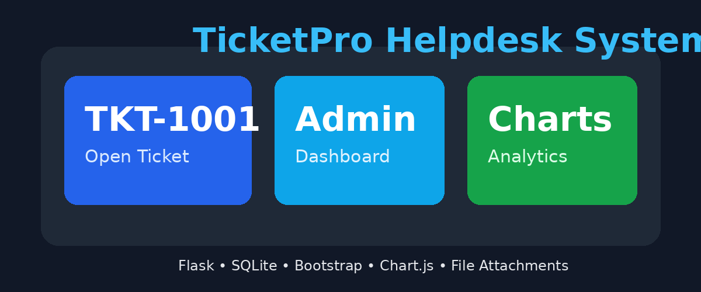

# 🎫 TicketPro Helpdesk System



## 📌 Project Overview

**TicketPro Helpdesk System** is a full-stack ticket management web application built using **Python Flask, SQLite, Bootstrap, HTML, CSS, JavaScript, and Chart.js**.  

This project allows customers to raise support tickets, while admins and support engineers can manage, update, filter, and analyze tickets through a professional dashboard.

---

## 🚀 Features

- 🔐 Admin and Support Engineer Login
- 🎫 Auto-generated Ticket IDs like `TKT-1001`
- 👤 Customer Portal to raise tickets
- 👨‍💻 Engineer Dashboard
- 📊 Dashboard with charts
- 🔎 Search tickets by customer, email, title, or ticket ID
- 📅 Date filters
- 🏷️ Priority management: Low, Medium, High, Critical
- 🔄 Status tracking: Open, In Progress, Resolved, Closed
- 📎 File attachment upload
- 📈 Analytics page
- 🗑️ Admin-only delete option
- ⭐ Modern Bootstrap UI
- 📱 Responsive design

---

## 🛠️ Technologies Used

| Layer | Technology |
|---|---|
| Frontend | HTML, CSS, Bootstrap, JavaScript |
| Backend | Python Flask |
| Database | SQLite |
| Charts | Chart.js |
| File Upload | Flask + Werkzeug |

---

## 📂 Project Structure

```text
TicketPro Helpdesk Project
│
├── app.py
├── requirements.txt
├── database.db
│
├── templates
│   ├── base.html
│   ├── customer.html
│   ├── login.html
│   ├── dashboard.html
│   ├── tickets.html
│   ├── ticket_detail.html
│   └── analytics.html
│
├── static
│   └── style.css
│
└── uploads
```

---

## ⚙️ Installation and Setup

### 1. Clone or download the project

```bash
git clone https://github.com/your-username/ticketpro-helpdesk.git
cd ticketpro-helpdesk
```

### 2. Install required packages

```bash
pip install -r requirements.txt
```

### 3. Run the Flask application

```bash
py app.py
```

or

```bash
python app.py
```

### 4. Open in browser

```text
http://127.0.0.1:5000
```

---

## 🔑 Login Credentials

### Admin Login

```text
Email: admin@ticketpro.com
Password: admin123
```

### Support Engineer Login

```text
Email: engineer@ticketpro.com
Password: engineer123
```

---

## 🧭 Application Flow

```text
Customer
   ↓
Raises Support Ticket
   ↓
Ticket Stored in SQLite Database
   ↓
Admin / Support Engineer Login
   ↓
Engineer Views Ticket
   ↓
Assigns Priority and Status
   ↓
Updates Progress
   ↓
Issue Resolved
   ↓
Ticket Closed
   ↓
Analytics and Reports Generated
```

---

## 🗃️ Database Tables

### `users`

Stores admin and engineer login details.

| Column | Description |
|---|---|
| id | User ID |
| name | User name |
| email | Login email |
| password | Login password |
| role | admin or engineer |

### `tickets`

Stores all ticket details.

| Column | Description |
|---|---|
| id | Ticket database ID |
| ticket_code | Ticket ID like TKT-1001 |
| customer_name | Customer name |
| customer_email | Customer email |
| title | Issue title |
| description | Issue description |
| category | Issue category |
| priority | Ticket priority |
| status | Ticket status |
| assigned_engineer | Engineer name |
| progress | Progress update |
| attachment | Uploaded file |
| created_at | Ticket created date |
| updated_at | Last updated date |

---

## 📊 Dashboard and Analytics

The dashboard shows:

- Total Tickets
- Open Tickets
- In Progress Tickets
- Resolved Tickets
- Closed Tickets
- Critical Tickets

The analytics page includes:

- Tickets by status
- Tickets by priority
- Daily ticket trend

---

## ✅ Future Enhancements

- Email notifications
- Customer ticket tracking page
- Password hashing
- Role-based permissions in detail
- Export reports to Excel or PDF
- Ticket comments history
- SLA tracking
- Email verification

---


## ⭐ Project Summary

This project demonstrates practical knowledge of full-stack development using Flask and SQLite. It is suitable for resumes, internships, and beginner-to-intermediate portfolio projects.
